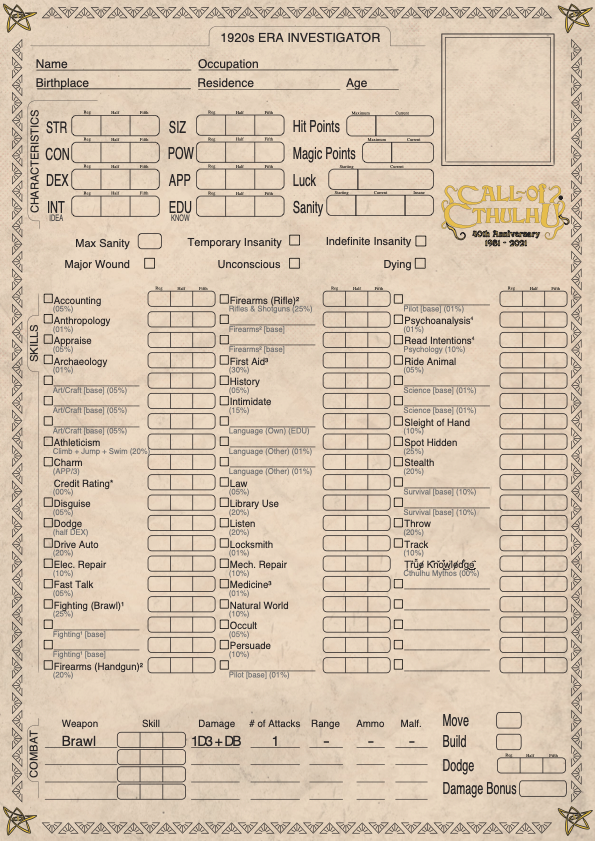

# Custom Call of Cthulhu 7th Edition Character Sheets

Simple script to make fully customizable Call of Cthulhu 7th Edition Character Sheets. To use, an svg template must be provided, as well as a json file containing the content to be filled. This allows translations into any language and/or customization of the skills.

## Setup

``` bash
pip install -r requirements.txt
sudo apt install libcairo2 # Ubuntu/Debian
brew install cairo # macOS
```

Remember to install the required fonts, listed in the ```templates/font_dependencies.yaml``` file.

## How to use

```bash
python3 translator.py {template_path} {parameter_path} {output_path}
```

Example:



```bash
python3 translator.py examples/template-CoC.svg examples/translation-CoC-custom-en.json "local/custom-CoC-en.pdf"
```
